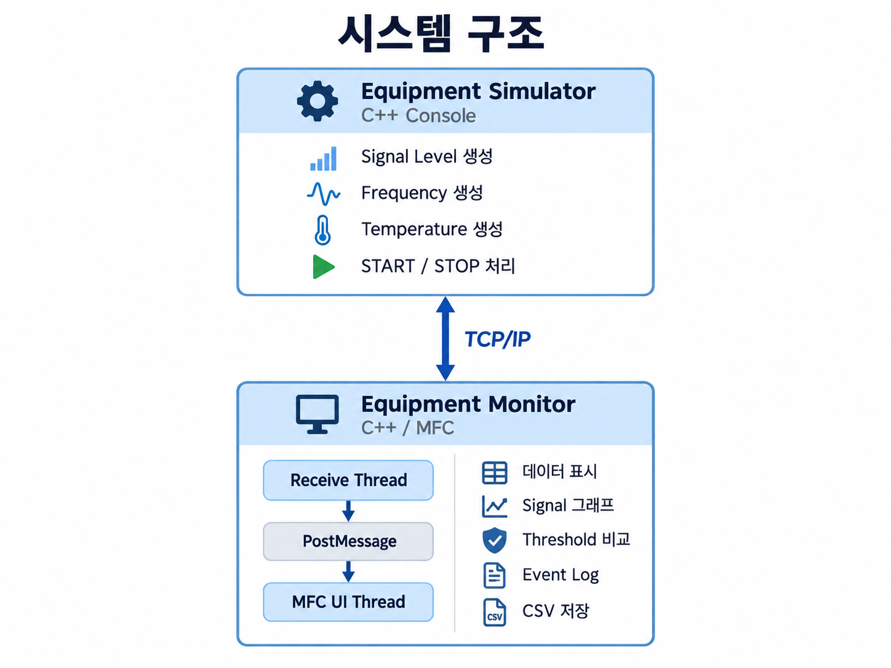
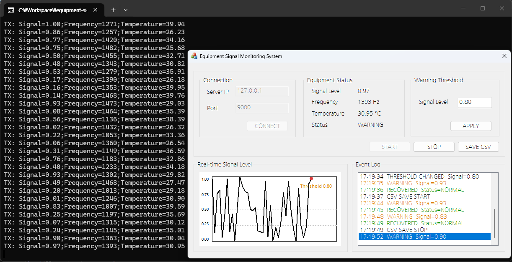

# C++/MFC 기반 신호 모니터링 프로그램

> TCP/IP로 가상 장비 데이터를 수신하고 MFC 화면에서 상태·그래프·로그를 확인할 수 있도록 구현한 Windows 데스크톱 프로젝트

## 프로젝트 개요

| 구분 | 내용 |
| --- | --- |
| 구현 범위 | TCP/IP 데이터 수신, 데이터 표시 및 상태 판정, CSV 저장 |
| Language | C++ |
| Framework | MFC |
| 통신 | TCP/IP, Winsock2 |
| 데이터 | Signal Level, Frequency, Temperature |
| 개발 환경 | Windows, Visual Studio |

## 프로젝트 소개

실제 장비 없이 TCP/IP 통신과 데이터 표시 과정을 구현하기 위해  
**C++ 기반 Equipment Simulator**와 **MFC 기반 Equipment Monitor**를 구성했습니다.

Equipment Simulator는 Signal Level, Frequency, Temperature 값을 임의로 생성하여 TCP/IP로 전송합니다.

Equipment Monitor는 별도의 수신 스레드에서 데이터를 받아 화면에 표시하고, Signal Level을 그래프로 나타냅니다.

또한 사용자가 설정한 Threshold와 Signal Level을 비교하여 NORMAL·WARNING 상태를 구분하고, 연결·START·STOP·상태 변화 등의 내용을 Event Log에 기록하도록 구성했습니다.

필요한 경우 수신 데이터를 CSV 파일로 저장할 수 있습니다.

## 주요 기능

### 1. TCP/IP 연결 및 데이터 수신

* Winsock2를 이용한 TCP 서버·클라이언트 통신
* Equipment Simulator를 TCP 서버로 구성
* Equipment Monitor를 TCP 클라이언트로 구성
* IP·Port 입력을 통한 연결
* 연결 종료 시 UI와 소켓 상태 정리

기본 접속 정보는 다음과 같습니다.

```text
Server IP : 127.0.0.1
Port      : 9000
```

### 2. 가상 데이터 생성

실제 센서나 장비 없이 기능을 확인할 수 있도록 Equipment Simulator에서 임의의 값을 생성합니다.

| 데이터 | 범위 |
| --- | --- |
| Signal Level | 0.00 ~ 1.00 |
| Frequency | 1000 ~ 1500 Hz |
| Temperature | 25.00 ~ 40.00 °C |

Signal Level은 실제 특정 장비의 물리 신호를 의미하는 값이 아니라,  
프로그램의 상태 판정과 그래프 표시를 위해 `0.0 ~ 1.0` 범위로 설정한 가상 값입니다.

### 3. START·STOP

Monitor에서 Simulator로 다음 명령을 보낼 수 있습니다.

```text
START
STOP
```

`START`를 누르면 Simulator가 데이터를 생성하여 전송하고,  
`STOP`을 누르면 TCP 연결은 유지한 상태에서 데이터 전송만 중지합니다.

### 4. 수신 데이터 표시

수신한 값을 MFC 화면에 표시합니다.

```text
Signal Level
Frequency
Temperature
Status
```

새로운 데이터가 수신될 때마다 화면의 값과 Signal Level 그래프를 갱신합니다.

### 5. Signal Level Threshold

사용자가 입력한 Threshold와 현재 Signal Level을 비교하여 상태를 구분합니다.

```text
Signal Level < Threshold
→ NORMAL

Signal Level >= Threshold
→ WARNING
```

기본 Threshold 값은 다음과 같습니다.

```text
0.80
```

입력 가능한 범위는 `0.0 ~ 1.0`이며, 숫자 형식과 범위를 확인한 뒤 적용하도록 구현했습니다.

Threshold가 변경되면 그래프에 표시되는 기준선도 함께 변경됩니다.

### 6. Signal Level 그래프

MFC Owner Draw를 이용해 Signal Level 변화를 그래프로 표시했습니다.

* Y축 범위 `0.00 ~ 1.00`
* 최근 최대 50개 Signal Level 표시
* `0.25`, `0.50`, `0.75` 기준선 표시
* Warning Threshold 점선 표시
* 최신 Signal 위치 표시
* Threshold 이상일 경우 최신 위치를 다른 색으로 표시

최근 50개의 값만 유지하여 오래된 데이터는 순서대로 제거합니다.

### 7. Event Log

주요 동작과 상태 변화를 시간과 함께 기록합니다.

```text
CONNECTED
START
STOP
WARNING
RECOVERED
THRESHOLD CHANGED
CSV SAVE START
CSV SAVE STOP
COMM ERROR
DISCONNECTED
```

로그 종류에 따라 글자 색상을 구분했습니다.

* WARNING : 주황색
* RECOVERED : 초록색
* COMM ERROR : 빨간색
* 그 외 : 검정색

### 8. CSV 저장

수신한 데이터를 CSV 파일로 저장할 수 있도록 구현했습니다.

```csv
timestamp,signal,frequency,temperature,status
15:30:26,0.72,1284,31.48,NORMAL
15:30:27,0.91,1310,32.12,WARNING
```

저장 항목은 다음과 같습니다.

| 항목 | 내용 |
| --- | --- |
| timestamp | 데이터 수신 시간 |
| signal | Signal Level |
| frequency | Frequency |
| temperature | Temperature |
| status | NORMAL / WARNING |

`SAVE CSV` 버튼을 누르면 저장 위치를 선택할 수 있고,  
저장 중에는 버튼이 `STOP CSV`로 변경됩니다.

TCP 연결이 종료되면 열려 있는 CSV 파일도 함께 닫도록 처리했습니다.

## 시스템 구조



Equipment Simulator에서 생성한 가상 데이터를 TCP/IP로 Equipment Monitor에 전달하고, Monitor에서는 별도의 Receive Thread에서 데이터를 수신한 뒤 `PostMessage()`를 통해 UI Thread로 전달하도록 구성했습니다.

## 실행 화면



Equipment Simulator에서 생성한 데이터를 TCP/IP로 수신하고, Signal Level, Frequency, Temperature와 상태를 화면에 표시합니다.

Signal Level 그래프와 Threshold 기준, Event Log를 통해 데이터 변화와 상태 전환을 확인할 수 있습니다.

## 데이터 흐름

### 데이터 수신

1. Equipment Simulator에서 Signal Level, Frequency, Temperature 값을 생성합니다.
2. TCP/IP를 통해 Equipment Monitor로 데이터를 전송합니다.
3. Receive Thread에서 `recv()`로 데이터를 수신합니다.
4. 수신 데이터를 문자열 버퍼에 누적합니다.
5. `\n`을 기준으로 하나의 데이터를 분리합니다.
6. Signal Level, Frequency, Temperature 값을 파싱합니다.
7. `PostMessage()`를 이용해 UI Thread로 데이터를 전달합니다.
8. 화면의 값과 그래프를 갱신합니다.
9. Signal Level과 Threshold를 비교하여 NORMAL·WARNING 상태를 구분합니다.
10. CSV 저장이 활성화된 경우 데이터를 파일에 기록합니다.

### START·STOP

1. Monitor에서 START 또는 STOP 버튼을 선택합니다.
2. TCP/IP를 통해 명령을 Simulator로 전송합니다.
3. Simulator에서 명령을 확인합니다.
4. START 상태에서는 데이터를 생성·전송합니다.
5. STOP 상태에서는 데이터 전송을 중지합니다.

## TCP 통신 형식

### Simulator → Monitor

Simulator에서는 다음 형식으로 데이터를 전송합니다.

```text
Signal=0.72;Frequency=1284;Temperature=31.48
```

각 데이터의 마지막에는 개행 문자 `\n`을 추가합니다.

```text
Signal=0.72;Frequency=1284;Temperature=31.48\n
```

Monitor에서는 수신 데이터를 문자열 버퍼에 누적한 뒤 `\n`을 기준으로 데이터를 분리합니다.

### Monitor → Simulator

Monitor에서는 다음 명령을 전송합니다.

```text
START\n
STOP\n
```

## 주요 구현 내용

### Receive Thread와 UI Thread 분리

TCP의 `recv()`는 데이터가 들어올 때까지 대기할 수 있기 때문에 UI Thread에서 직접 실행하지 않고 별도의 Receive Thread에서 처리했습니다.

```text
MFC UI Thread
      │
      └─ AfxBeginThread()
              │
              ▼
        Receive Thread
              │
              ├─ recv()
              ├─ Buffer 누적
              ├─ 데이터 파싱
              │
              └─ PostMessage()
                      │
                      ▼
                MFC UI Thread
```

Receive Thread에서는 데이터 수신과 파싱을 담당하고,  
MFC Control 변경은 `PostMessage()`를 통해 UI Thread에서 처리하도록 구성했습니다.

### TCP 수신 데이터 분리

TCP에서는 한 번의 `send()`와 한 번의 `recv()`가 항상 같은 단위로 처리되는 것이 아니기 때문에 수신 데이터를 바로 파싱하지 않았습니다.

수신한 문자열을 `receiveBuffer`에 누적하고 개행 문자가 있을 때 한 줄씩 꺼내도록 구현했습니다.

```text
recv()
  ↓
receiveBuffer 누적
  ↓
'\n' 검색
  ↓
한 줄 추출
  ↓
Signal / Frequency / Temperature 파싱
```

### Simulator와 Monitor 역할 분리

Simulator는 가상 데이터를 생성하고 전송하는 역할을 담당합니다.

```text
Equipment Simulator
→ Signal Level
→ Frequency
→ Temperature
```

NORMAL·WARNING 상태는 Simulator에서 보내지 않고 Monitor에서 판단합니다.

```text
Equipment Monitor
→ Signal Level 수신
→ Threshold 비교
→ NORMAL / WARNING
```

이렇게 구성하여 Threshold 변경은 Monitor 내부에서 처리하도록 했습니다.

### Signal Level 그래프

수신한 Signal Level을 `std::vector`에 저장하고 MFC Owner Draw를 이용해 그래프를 그렸습니다.

최대 50개의 최근 데이터만 유지하고, 새로운 값이 추가되면 그래프 영역을 다시 그리도록 구성했습니다.

Threshold도 그래프에 함께 표시하여 현재 Signal 값과 기준값을 비교할 수 있도록 했습니다.

### 상태 변화 로그

모든 수신 값을 Event Log에 출력하지 않고 상태가 변경될 때 관련 로그를 남기도록 구현했습니다.

```text
NORMAL → WARNING
→ WARNING

WARNING → NORMAL
→ RECOVERED
```

이외에도 연결, START·STOP, Threshold 변경, CSV 저장, 통신 오류 등의 내용을 기록합니다.

### 연결 종료 처리

Simulator 종료 등으로 TCP 연결이 끊어지면 Receive Thread에서 연결 종료를 확인하고 UI 상태를 정리합니다.

```text
Status → DISCONNECTED
START / STOP 비활성화
CONNECT 활성화
IP / Port 입력 활성화
CSV 파일 닫기
Socket 정리
```

## 기술 스택

| 구분 | 기술 | 활용 내용 |
| --- | --- | --- |
| Language | C++ | Simulator와 Monitor 구현 |
| Framework | MFC | Windows 데스크톱 UI |
| Network | Winsock2 | TCP 서버·클라이언트 통신 |
| Thread | AfxBeginThread | TCP 데이터 수신 |
| Windows | PostMessage | Receive Thread에서 UI Thread로 데이터 전달 |
| UI | Owner Draw | Signal 그래프, Event Log 표시 |
| Data | CSV | 수신 데이터 저장 |
| Tool | Visual Studio | 프로젝트 개발 |

## 프로젝트 구조

```text
equipment-signal-monitoring-system/
├─ EquipmentSignalMonitoring/
│  ├─ EquipmentSignalMonitoring.slnx
│  ├─ EquipmentSimulator/
│  │  └─ EquipmentSimulator.cpp
│  └─ EquipmentMonitor/
│     ├─ EquipmentMonitor.cpp
│     ├─ EquipmentMonitor.h
│     ├─ EquipmentMonitorDlg.cpp
│     ├─ EquipmentMonitorDlg.h
│     ├─ EquipmentMonitor.rc
│     └─ resource.h
├─ images/
│  ├─ system-architecture.png
│  └─ equipment-monitor-main.png
├─ .gitignore
└─ README.md
```

## 주요 소스

| 경로 | 역할 |
| --- | --- |
| `EquipmentSignalMonitoring/EquipmentSimulator/EquipmentSimulator.cpp` | TCP 서버, 가상 데이터 생성, START·STOP 처리 |
| `EquipmentSignalMonitoring/EquipmentMonitor/EquipmentMonitorDlg.cpp` | TCP 연결·수신, UI 갱신, 그래프, Event Log, CSV 저장 |
| `EquipmentSignalMonitoring/EquipmentMonitor/EquipmentMonitorDlg.h` | 수신 데이터 구조체와 Monitor 관련 멤버 정의 |
| `EquipmentSignalMonitoring/EquipmentMonitor/EquipmentMonitor.rc` | MFC Dialog와 Control 구성 |
| `EquipmentSignalMonitoring/EquipmentMonitor/resource.h` | Control Resource ID 정의 |

## 실행 방법

### 1. 솔루션 열기

Visual Studio에서 다음 파일을 엽니다.

```text
EquipmentSignalMonitoring/EquipmentSignalMonitoring.slnx
```

### 2. Equipment Simulator 실행

먼저 `EquipmentSimulator`를 실행합니다.

정상 실행 시 다음 메시지가 출력됩니다.

```text
Equipment Simulator Server
Waiting for client on port 9000...
```

### 3. Equipment Monitor 실행

`EquipmentMonitor`를 실행합니다.

기본 접속 정보는 다음과 같습니다.

```text
Server IP : 127.0.0.1
Port      : 9000
```

`CONNECT` 버튼을 눌러 Simulator와 연결합니다.

### 4. 데이터 수신

연결 후 `START` 버튼을 누르면 Simulator에서 데이터를 전송합니다.

Monitor 화면에서는 다음 값을 확인할 수 있습니다.

```text
Signal Level
Frequency
Temperature
Status
Real-time Signal Level
Event Log
```

### 5. Threshold 변경

Warning Threshold 영역에 원하는 값을 입력한 후 `APPLY` 버튼을 누릅니다.

```text
기본값    : 0.80
입력 범위 : 0.0 ~ 1.0
```

변경된 Threshold는 상태 판정과 그래프 기준선에 적용됩니다.

### 6. CSV 저장

`SAVE CSV` 버튼을 누르고 파일 저장 위치를 선택합니다.

데이터를 수신하는 동안 다음 값이 CSV 파일에 기록됩니다.

```text
Timestamp
Signal Level
Frequency
Temperature
Status
```

저장을 중지하려면 `STOP CSV` 버튼을 누릅니다.

### 7. 데이터 전송 중지

`STOP` 버튼을 누르면 Simulator에서 데이터 전송을 중지합니다.

TCP 연결은 유지되므로 다시 `START` 버튼을 누르면 데이터 전송을 재개할 수 있습니다.

## 구현 결과

C++ 기반 Simulator와 MFC Monitor를 구성하여 가상 데이터 생성부터 TCP/IP 통신, 수신 스레드 처리, UI 갱신, Threshold 기반 상태 판정, Event Log, CSV 저장까지 하나의 흐름으로 구현했습니다.

이 프로젝트를 통해 C++/MFC 환경에서 TCP/IP 통신과 수신 스레드, Windows Message를 이용한 UI 갱신, 그래프 표시와 데이터 저장 기능을 직접 구현했습니다.
